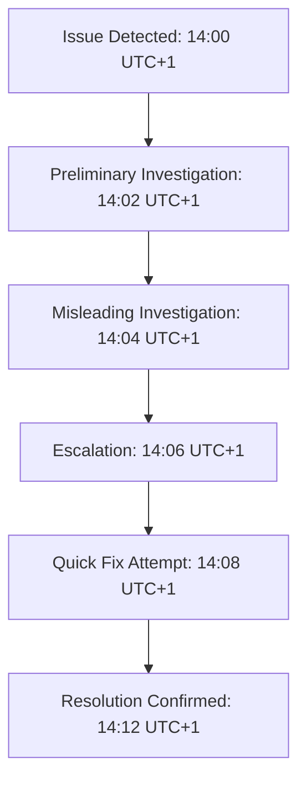

# Postmortem: The Nginx Rebellion Incident

## Issue Summary

On a fateful Wednesday, our beloved web service decided it was too cool for school by running as root instead of under the humble `nginx` user. The outage started at **14:00 UTC+1** and was resolved by **14:12 UTC+1**, creating a 12-minute rollercoaster of chaos. About 80% of users faced 503 errors while our Bash script—meant to be neat and 7 lines long—turned into a mischievous saboteur by running everything as root.

> **Meme Moment:**  
>   
> _When you think everything's fine, but your server's throwing a root party._

## Timeline

- **14:00 UTC+1 – Issue Detected:** A monitoring alert signaled a spike in 503 errors. Customers started complaining, and our dashboard looked like a scene from a disaster movie.
- **14:02 UTC+1 – Preliminary Investigation:** An engineer (the night owl of the team) noticed that the Nginx process was running as root. Cue the facepalm.
- **14:04 UTC+1 – Misleading Investigation Paths:** Initial blame was thrown at container misconfigurations and rogue processes. Turns out, our trusty Bash script had a secret identity.
- **14:06 UTC+1 – Escalation:** The issue was quickly escalated to the DevOps team and our resident security guru. The culprit? A single, misplaced command.
- **14:08 UTC+1 – Quick Fix Attempt:** A manual restart of Nginx under the correct user was attempted, with tests using the `whoami` check and netcat.
- **14:12 UTC+1 – Resolution Confirmed:** After the fix, monitoring confirmed Nginx was back to being a good little `nginx` user, and the chaos subsided.

## Root Cause and Resolution

The root cause was a misconfigured Bash script that was supposed to switch from root to the `nginx` user but ended up letting root run the show. This error in parameter parsing and environment handling not only risked our security but also sent our service into a tailspin.

**Resolution:**  
We revised the script to explicitly enforce the correct user context and added extra logging to catch any similar mishaps in the future. Extensive testing confirmed that Nginx now consistently runs under the proper user.

## Corrective and Preventative Measures

To ensure our server doesn't decide to go rogue again, we’re implementing the following:

- **Script Audit:** All Bash scripts will now undergo a rigorous review for security best practices.
- **Enhanced Monitoring:** Additional alerts are set up to detect any instance of critical processes running with inappropriate privileges.
- **CI/CD Pipeline Checks:** Our automated tests will now include user validation checks within container environments.
- **Documentation & Training:** We'll circulate a fun (and slightly sarcastic) primer on the importance of running services as non-root users.
- **Task List:**
  - [ ] Patch the Nginx startup script to enforce non-root execution.
  - [ ] Integrate monitoring to flag any user discrepancies.
  - [ ] Update the deployment pipeline with a user validation step.
  - [ ] Schedule a monthly configuration audit.

> **Meme Break:**  
>   
> _Bash Script (distracted by) Running as Root vs. Proper Configuration._

> **One Does Not Simply:**  
>   
> _One does not simply debug a production outage without a strong cup of coffee..._

## Diagram

Here's a fun diagram suggestion to visualize the timeline of our incident (you can create this using draw.io or Lucidchart and embed it as an image):

